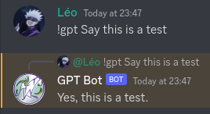

# gpt_bot
Discord Bot using ChatGPT

<br>

## Request your OpenAI API key

To use this bot, you must have an OpenAI API key following this link [https://beta.openai.com/account/api-keys](https://beta.openai.com/account/api-keys)

<br>

## Usage

### Using local project
**Please, fill environment variables in envrc using your tokens**

```bash
# Download dependencies
$ go mod download

# Run bot
$ go run github.com/zerlock/gpt_bot
```

### Using Dockerfile
**Please, fill environment variables in Dockerfile using your tokens**

```bash
# Build docker image
$ docker build . -t gpt_bot:latest

# Run docker image
$ docker run -t gpt_bot:latest
```

<br>

## Bot Commands

### **`!gpt <text>`**
Talk with ChatGPT, it answer you with Discord reply message

<details>
  <summary>Example</summary>
  <p>
    
  </p>
</details>

<br>

## Contribute
Please open up an issue on GitHub before you put a lot efforts on pull request.

<br>

## Mainteners

[Léo Dubosclard](https://linkedin.com/in/leo-dubosclard) - Project Owner - Developer
